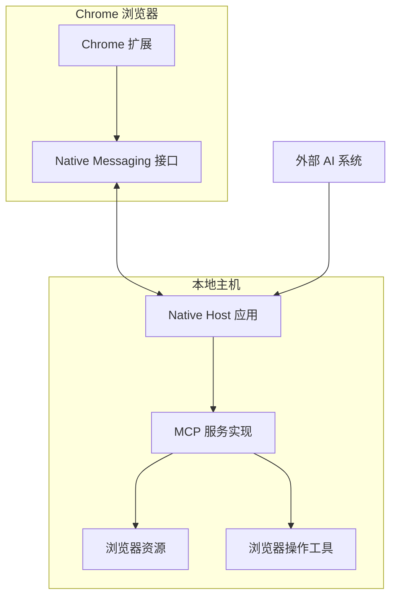

# Chrome Native Messaging Host for MCP SEE Service

## 1. 概述

本文档描述了使用 Chrome Native Messaging 实现 MCP (Model Context Protocol) SEE (Surface Extension Environments) 服务的方案。该方案旨在让 Chrome 扩展能够将浏览器状态和操作暴露为 MCP 资源和工具，供外部 AI 模型使用。

### 1.1 目标

- 在 Chrome 扩展和外部应用之间建立安全的通信通道
- 将浏览器状态（如 DOM 结构、截图、标签页信息）暴露为 MCP 资源
- 将浏览器操作（如点击、导航、表单填写）暴露为 MCP 工具
- 提供符合 SEE 协议的服务接口

### 1.2 优势

使用 Chrome Native Messaging 实现 SEE 服务有以下优势：

- **安全性**：无需开放网络端口，只允许授权的扩展和应用通信
- **性能**：通信开销低，直接在本地处理
- **稳定性**：Chrome 原生支持，不依赖第三方服务
- **隐私保护**：数据交换仅在用户设备本地进行

## 2. 系统架构

实现方案包括三个主要组件：Chrome 扩展、Native Messaging Host 和 MCP 服务实现。它们之间的关系如下：



### 2.1 数据流

1. Chrome 扩展捕获浏览器状态和用户操作
2. 扩展通过 Native Messaging 接口将数据发送到 Native Host 应用
3. Native Host 应用接收数据并转换为 MCP 资源和工具
4. 外部 AI 系统通过 Native Host 应用访问 MCP 服务
5. MCP 服务执行操作并返回结果

## 3. 技术组件

### 3.1 Chrome 扩展

Chrome 扩展负责：

- 监控浏览器状态（标签页、DOM、截图等）
- 提供用户界面控制
- 通过 Native Messaging API 与 Native Host 通信
- 执行来自 Native Host 的浏览器操作请求

#### 所需权限

```json
{
  "permissions": [
    "nativeMessaging",
    "tabs",
    "activeTab",
    "scripting",
    "storage"
  ],
  "host_permissions": [
    "<all_urls>"
  ]
}
```

### 3.2 Native Messaging Host

Native Host 是一个本地应用程序，它：

- 接收来自 Chrome 扩展的消息
- 处理消息协议（长度前缀的 JSON 消息）
- 实现 MCP 服务器
- 通过标准输入/输出与扩展通信

#### 清单文件

```json
{
  "name": "nanobrowser.mcp.host",
  "description": "Nanobrowser MCP Native Messaging Host",
  "path": "PATH_TO_HOST_EXECUTABLE",
  "type": "stdio",
  "allowed_origins": [
    "chrome-extension://EXTENSION_ID/"
  ]
}
```

### 3.3 MCP 服务实现

MCP 服务实现在 Native Host 中运行，它：

- 使用 MCP SDK 创建服务器实例
- 定义和实现浏览器资源和工具
- 处理请求和响应
- 管理状态和会话

## 4. 实现步骤

### 4.1 创建 Native Messaging Host

#### 4.1.1 设置项目结构

```
nanobrowser-mcp-host/
├── src/
│   ├── index.ts              # 主入口
│   ├── messaging.ts          # 消息处理
│   ├── mcp-server.ts         # MCP 服务器实现
│   ├── browser-resources.ts  # 浏览器资源定义
│   └── browser-tools.ts      # 浏览器工具定义
├── package.json
├── tsconfig.json
└── manifest.json             # Native Messaging Host 清单
```

#### 4.1.2 实现消息处理

```typescript
// messaging.ts
import { Readable, Writable } from 'stream';

interface Message {
  type: string;
  [key: string]: any;
}

export class NativeMessaging {
  private stdin: Readable;
  private stdout: Writable;
  private buffer: Buffer = Buffer.alloc(0);
  private messageHandlers: Map<string, (data: any) => Promise<any>> = new Map();

  constructor(stdin: Readable = process.stdin, stdout: Writable = process.stdout) {
    this.stdin = stdin;
    this.stdout = stdout;
    this.setupMessageHandling();
  }

  private setupMessageHandling() {
    // Chrome 使用长度前缀的 JSON 消息
    this.stdin.on('readable', () => {
      let chunk: Buffer | null;
      while ((chunk = this.stdin.read() as Buffer | null) !== null) {
        this.buffer = Buffer.concat([this.buffer, chunk]);
        this.processBuffer();
      }
    });

    this.stdin.on('end', () => {
      process.exit(0);
    });
  }

  private processBuffer() {
    // 消息格式：4 字节长度前缀 + JSON
    if (this.buffer.length < 4) return;

    const messageLength = this.buffer.readUInt32LE(0);
    if (this.buffer.length < messageLength + 4) return;

    const messageJson = this.buffer.subarray(4, messageLength + 4).toString('utf8');
    this.buffer = this.buffer.subarray(messageLength + 4);

    try {
      const message = JSON.parse(messageJson);
      this.handleMessage(message);
    } catch (error) {
      console.error('Error parsing message:', error);
    }

    // 继续处理缓冲区，可能有多个消息
    if (this.buffer.length >= 4) {
      this.processBuffer();
    }
  }

  private async handleMessage(message: Message) {
    const { type, ...data } = message;
    const handler = this.messageHandlers.get(type);

    if (!handler) {
      console.error(`No handler registered for message type: ${type}`);
      this.sendMessage({ type: 'error', error: `Unknown message type: ${type}` });
      return;
    }

    try {
      const result = await handler(data);
      this.sendMessage({ type: `${type}_result`, ...result });
    } catch (error) {
      console.error(`Error handling message type ${type}:`, error);
      this.sendMessage({ 
        type: 'error', 
        originalType: type, 
        error: error instanceof Error ? error.message : String(error) 
      });
    }
  }

  public registerHandler(type: string, handler: (data: any) => Promise<any>) {
    this.messageHandlers.set(type, handler);
  }

  public sendMessage(message: any) {
    const messageJson = JSON.stringify(message);
    const messageBuffer = Buffer.from(messageJson, 'utf8');
    const length = messageBuffer.length;

    const buffer = Buffer.alloc(4 + length);
    buffer.writeUInt32LE(length, 0);
    messageBuffer.copy(buffer, 4);
    
    this.stdout.write(buffer);
  }
}
```

#### 4.1.3 实现 MCP 服务器

```typescript
// mcp-server.ts
import { Server } from '@modelcontextprotocol/sdk/server/index.js';
import { 
  ListResourcesRequestSchema, 
  ListToolsRequestSchema,
  ReadResourceRequestSchema,
  CallToolRequestSchema,
  McpError,
  ErrorCode
} from '@modelcontextprotocol/sdk/types.js';
import { BrowserResources } from './browser-resources';
import { BrowserTools } from './browser-tools';

export class McpServer {
  private server: Server;
  private browserResources: BrowserResources;
  private browserTools: BrowserTools;

  constructor() {
    this.server = new Server(
      {
        name: 'nanobrowser-mcp-server',
        version: '0.1.0',
      },
      {
        capabilities: {
          resources: {},
          tools: {},
        },
      }
    );

    this.browserResources = new BrowserResources();
    this.browserTools = new BrowserTools();

    this.setupResourceHandlers();
    this.setupToolHandlers();
    
    // Error handling
    this.server.onerror = (error) => console.error('[MCP Error]', error);
    process.on('SIGINT', async () => {
      await this.server.close();
      process.exit(0);
    });
  }

  private setupResourceHandlers() {
    this.server.setRequestHandler(ListResourcesRequestSchema, async () => ({
      resources: this.browserResources.listResources(),
    }));

    this.server.setRequestHandler(ReadResourceRequestSchema, async (request) => {
      return this.browserResources.readResource(request.params.uri);
    });
  }

  private setupToolHandlers() {
    this.server.setRequestHandler(ListToolsRequestSchema, async () => ({
      tools: this.browserTools.listTools(),
    }));

    this.server.setRequestHandler(CallToolRequestSchema, async (request) => {
      return this.browserTools.callTool(
        request.params.name,
        request.params.arguments
      );
    });
  }

  public setBrowserState(state: any) {
    this.browserResources.updateState(state);
  }

  public async executeBrowserAction(action: string, params: any): Promise<any> {
    return this.browserTools.executeAction(action, params);
  }
}
```

#### 4.1.4 主入口

```typescript
// index.ts
import { NativeMessaging } from './messaging';
import { McpServer } from './mcp-server';

// 初始化组件
const messaging = new NativeMessaging();
const mcpServer = new McpServer();

// 注册消息处理器
messaging.registerHandler('setBrowserState', async (data) => {
  mcpServer.setBrowserState(data);
  return { success: true };
});

messaging.registerHandler('executeAction', async (data) => {
  const { action, params } = data;
  const result = await mcpServer.executeBrowserAction(action, params);
  return { result };
});

// 启动消息处理
console.error('Native messaging host started');
```

### 4.2 Chrome 扩展实现

#### 4.2.1 扩展清单

```json
{
  "name": "Nanobrowser MCP",
  "version": "1.0",
  "manifest_version": 3,
  "description": "Provides MCP services through Native Messaging",
  "permissions": [
    "nativeMessaging",
    "tabs",
    "activeTab",
    "scripting",
    "storage"
  ],
  "host_permissions": [
    "<all_urls>"
  ],
  "background": {
    "service_worker": "background.js"
  },
  "action": {
    "default_title": "Nanobrowser MCP"
  }
}
```

#### 4.2.2 后台脚本

```typescript
// background.js
let nativePort = null;
let browserState = null;
let stateUpdateInterval = null;

// 连接到 Native Messaging Host
function connectToNativeHost() {
  try {
    nativePort = chrome.runtime.connectNative('nanobrowser.mcp.host');
    
    nativePort.onMessage.addListener((message) => {
      console.log('Received message from native host:', message);
      handleNativeMessage(message);
    });
    
    nativePort.onDisconnect.addListener(() => {
      const error = chrome.runtime.lastError;
      console.error('Native messaging host disconnected:', error);
      nativePort = null;
      
      // 尝试重新连接
      setTimeout(connectToNativeHost, 5000);
    });
    
    // 开始定时发送浏览器状态
    startStateUpdates();
    
    return true;
  } catch (error) {
    console.error('Failed to connect to native host:', error);
    return false;
  }
}

// 处理来自 Native Host 的消息
function handleNativeMessage(message) {
  if (!message || !message.type) return;
  
  switch (message.type) {
    case 'executeAction_result':
      handleActionResult(message);
      break;
    case 'error':
      console.error('Error from native host:', message.error);
      break;
  }
}

// 处理操作结果
function handleActionResult(message) {
  const { result } = message;
  
  if (result && result.action) {
    switch (result.action) {
      case 'navigate':
        navigateToUrl(result.url);
        break;
      case 'click':
        clickElement(result.selector);
        break;
      case 'type':
        typeText(result.selector, result.text);
        break;
      // 其他操作...
    }
  }
}

// 开始定时更新浏览器状态
function startStateUpdates() {
  if (stateUpdateInterval) {
    clearInterval(stateUpdateInterval);
  }
  
  // 立即发送一次状态
  updateBrowserState();
  
  // 设置定时更新
  stateUpdateInterval = setInterval(updateBrowserState, 2000);
}

// 更新浏览器状态
async function updateBrowserState() {
  if (!nativePort) return;
  
  try {
    // 获取活动标签
    const [activeTab] = await chrome.tabs.query({ active: true, currentWindow: true });
    if (!activeTab || !activeTab.id) return;
    
    // 获取 DOM 状态
    // 这里可能需要使用 chrome.scripting.executeScript 注入脚本获取 DOM
    const domState = await getDomState(activeTab.id);
    
    // 获取所有标签页
    const tabs = await chrome.tabs.query({});
    const tabInfos = tabs.map(tab => ({
      id: tab.id,
      url: tab.url,
      title: tab.title,
      active: tab.active
    }));
    
    // 更新状态
    browserState = {
      activeTab: {
        id: activeTab.id,
        url: activeTab.url,
        title: activeTab.title,
        domState
      },
      tabs: tabInfos
    };
    
    // 发送到 Native Host
    nativePort.postMessage({
      type: 'setBrowserState',
      state: browserState
    });
    
  } catch (error) {
    console.error('Error updating browser state:', error);
  }
}

// 获取 DOM 状态
async function getDomState(tabId) {
  try {
    const results = await chrome.scripting.executeScript({
      target: { tabId },
      func: () => {
        // 简化的 DOM 序列化逻辑
        function serializeNode(node, maxDepth = 3, depth = 0) {
          if (depth > maxDepth) return null;
          
          if (node.nodeType === Node.TEXT_NODE) {
            return {
              type: 'text',
              value: node.textContent
            };
          }
          
          if (node.nodeType === Node.ELEMENT_NODE) {
            const element = node;
            
            // 收集属性
            const attributes = {};
            for (const attr of element.attributes) {
              attributes[attr.name] = attr.value;
            }
            
            // 收集子节点
            const children = [];
            for (let i = 0; i < element.childNodes.length; i++) {
              const childNode = element.childNodes[i];
              const serializedChild = serializeNode(childNode, maxDepth, depth + 1);
              if (serializedChild) {
                children.push(serializedChild);
              }
            }
            
            return {
              type: 'element',
              tagName: element.tagName.toLowerCase(),
              attributes,
              children
            };
          }
          
          return null;
        }
        
        // 序列化可见部分的 DOM
        return serializeNode(document.body);
      }
    });
    
    return results[0]?.result || null;
  } catch (error) {
    console.error('Error getting DOM state:', error);
    return null;
  }
}

// 浏览器操作函数
async function navigateToUrl(url) {
  if (!url) return;
  
  try {
    const [activeTab] = await chrome.tabs.query({ active: true, currentWindow: true });
    if (activeTab && activeTab.id) {
      await chrome.tabs.update(activeTab.id, { url });
    } else {
      await chrome.tabs.create({ url });
    }
  } catch (error) {
    console.error('Error navigating to URL:', error);
  }
}

async function clickElement(selector) {
  if (!selector) return;
  
  try {
    const [activeTab] = await chrome.tabs.query({ active: true, currentWindow: true });
    if (!activeTab || !activeTab.id) return;
    
    await chrome.scripting.executeScript({
      target: { tabId: activeTab.id },
      func: (sel) => {
        const element = document.querySelector(sel);
        if (element) element.click();
      },
      args: [selector]
    });
  } catch (error) {
    console.error('Error clicking element:', error);
  }
}

async function typeText(selector, text) {
  if (!selector || !text) return;
  
  try {
    const [activeTab] = await chrome.tabs.query({ active: true, currentWindow: true });
    if (!activeTab || !activeTab.id) return;
    
    await chrome.scripting.executeScript({
      target: { tabId: activeTab.id },
      func: (sel, txt) => {
        const element = document.querySelector(sel);
        if (element) {
          element.value = txt;
          element.dispatchEvent(new Event('input', { bubbles: true }));
          element.dispatchEvent(new Event('change', { bubbles: true }));
        }
      },
      args: [selector, text]
    });
  } catch (error) {
    console.error('Error typing text:', error);
  }
}

// 初始化连接
connectToNativeHost();
```

### 4.3 浏览器资源和工具实现

#### 4.3.1 浏览器资源

```typescript
// browser-resources.ts
export class BrowserResources {
  private browserState: any = null;

  constructor() {}

  public updateState(state: any) {
    this.browserState = state;
  }

  public listResources() {
    return [
      {
        uri: 'browser://current/state',
        name: '当前浏览器状态',
        mimeType: 'application/json',
        description: '包含当前活动页面和所有标签页的完整状态'
      },
      {
        uri: 'browser://current/dom',
        name: '当前页面 DOM',
        mimeType: 'application/json',
        description: '当前页面的 DOM 结构'
      },
      {
        uri: 'browser://tabs',
        name: '标签页列表',
        mimeType: 'application/json',
        description: '所有打开的标签页信息'
      }
    ];
  }

  public async readResource(uri: string) {
    if (!this.browserState) {
      throw new Error('Browser state not available');
    }

    switch (uri) {
      case 'browser://current/state':
        return {
          contents: [
            {
              uri,
              mimeType: 'application/json',
              text: JSON.stringify(this.browserState, null, 2)
            }
          ]
        };

      case 'browser://current/dom':
        return {
          contents: [
            {
              uri,
              mimeType: 'application/json',
              text: JSON.stringify(this.browserState?.activeTab?.domState || {}, null, 2)
            }
          ]
        };

      case 'browser://tabs':
        return {
          contents: [
            {
              uri,
              mimeType: 'application/json',
              text: JSON.stringify(this.browserState?.tabs || [], null, 2)
            }
          ]
        };

      default:
        throw new Error(`Resource not found: ${uri}`);
    }
  }
}
```

#### 4.3.2 浏览器工具

```typescript
// browser-tools.ts
export class BrowserTools {
  private actions: Map<string, (params: any) => Promise<any>> = new Map();
  private browserActionCallback: ((action: string, params: any) => Promise<any>) | null = null;

  constructor() {
    // 注册默认动作处理器
    this.actions.set('navigate', this.navigate.bind(this));
    this.actions.set('click', this.clickElement.bind(this));
    this.actions.set('type', this.typeText.bind(this));
    this.actions.set('submit', this.submitForm.bind(this));
    this.actions.set('openTab', this.openTab.bind(this));
    this.actions.set('closeTab', this.closeTab.bind(this));
    this.actions.set('switchTab', this.switchTab.bind(this));
  }

  public setBrowserActionCallback(callback: (action: string, params: any) => Promise<any>) {
    this.browserActionCallback = callback;
  }

  public listTools() {
    return [
      {
        name: 'navigate_to',
        description: '导航到指定 URL',
        inputSchema: {
          type: 'object',
          properties: {
            url: {
              type: 'string',
              description: '要导航到的 URL'
            }
          },
          required: ['url']
        }
      },
      {
        name: 'click_element',
        description: '点击指定的元素',
        inputSchema: {
          type: 'object',
          properties: {
            selector: {
              type: 'string',
              description: '要点击的元素的 CSS 选择器'
            }
          },
          required: ['selector']
        }
      },
      {
        name: 'input_text',
        description: '在指定的输入元素中输入文本',
        inputSchema: {
          type: 'object',
          properties: {
            selector: {
              type: 'string',
              description: '输入元素的 CSS 选择器'
            },
            text: {
              type: 'string',
              description: '要输入的文本'
            }
          },
          required: ['selector', 'text']
        }
      },
      {
        name: 'submit_form',
        description: '提交表单',
        inputSchema: {
          type: 'object',
          properties: {
            selector: {
              type: 'string',
              description: '表单的 CSS 选择器'
            }
          },
          required: ['selector']
        }
      },
      {
        name: 'open_tab',
        description: '打开新标签页',
        inputSchema: {
          type: 'object',
          properties: {
            url: {
              type: 'string',
              description: '要在新标签页中打开的 URL'
            }
          },
          required: ['url']
        }
      },
      {
        name: 'close_tab',
        description: '关闭标签页',
        inputSchema: {
          type: 'object',
          properties: {
            tabId: {
              type: 'number',
              description: '要关闭的标签页 ID'
            }
          },
          required: ['tabId']
        }
      },
      {
        name: 'switch_tab',
        description: '切换到指定标签页',
        inputSchema: {
          type: 'object',
          properties: {
            tabId: {
              type: 'number',
              description: '要切换到的标签页 ID'
            }
          },
          required: ['tabId']
        }
      }
    ];
  }

  public async callTool(name: string, args: any) {
    switch (name) {
      case 'navigate_to':
        return this.executeAction('navigate', { url: args.url });
      
      case 'click_element':
        return this.executeAction('click', { selector: args.selector });
      
      case 'input_text':
        return this.executeAction('type', { selector: args.selector, text: args.text });
      
      case 'submit_form':
        return this.executeAction('submit', { selector: args.selector });
      
      case 'open_tab':
        return this.executeAction('openTab', { url: args.url });
      
      case 'close_tab':
        return this.executeAction('closeTab', { tabId: args.tabId });
      
      case 'switch_tab':
        return this.executeAction('switchTab', { tabId: args.tabId });
      
      default:
        throw new Error(`Unknown tool: ${name}`);
    }
  }

  public async executeAction(action: string, params: any): Promise<any> {
    if (this.browserActionCallback) {
      return this.browserActionCallback(action, params);
    }

    const handler = this.actions.get(action);
    if (!handler) {
      throw new Error(`Unknown action: ${action}`);
    }

    return handler(params);
  }

  // 这些方法在 Native Host 中只是存根
  // 实际实现依赖于通过 browserActionCallback 转发到浏览器扩展
  
  private async navigate(params: any): Promise<any> {
    return { action: 'navigate', url: params.url };
  }

  private async clickElement(params: any): Promise<any> {
    return { action: 'click', selector: params.selector };
  }

  private async typeText(params: any): Promise<any> {
    return { action: 'type', selector: params.selector, text: params.text };
  }

  private async submitForm(params: any): Promise<any> {
    return { action: 'submit', selector: params.selector };
  }

  private async openTab(params: any): Promise<any> {
    return { action: 'openTab', url: params.url };
  }

  private async closeTab(params: any): Promise<any> {
    return { action: 'closeTab', tabId: params.tabId };
  }

  private async switchTab(params: any): Promise<any> {
    return { action: 'switchTab', tabId: params.tabId };
  }
}
```

### 4.4 安装和注册

#### 4.4.1 安装 Native Messaging Host

1. 构建 Native Host 应用：
   ```bash
   npm install
   npm run build
   ```

2. 安装 Native Messaging Host 清单：

   **Windows:**
   将清单文件保存到注册表：
   ```
   HKEY_CURRENT_USER\SOFTWARE\Google\Chrome\NativeMessagingHosts\nanobrowser.mcp.host
   ```

   **macOS:**
   将清单文件保存到：
   ```
   ~/Library/Application Support/Google/Chrome/NativeMessagingHosts/nanobrowser.mcp.host.json
   ```

   **Linux:**
   将清单文件保存到：
   ```
   ~/.config/google-chrome/NativeMessagingHosts/nanobrowser.mcp.host.json
   ```

#### 4.4.2 安装 Chrome 扩展

1. 在 Chrome 中加载未打包的扩展：
   - 打开 `chrome://extensions/`
   - 启用开发者模式
   - 点击"加载已解压的扩展程序"
   - 选择扩展目录

2. 获取扩展 ID 并更新 Native Messaging Host 清单中的 `allowed_origins`。

## 5. 安全考虑

### 5.1 潜在风险

- **权限过度**: Chrome 扩展有广泛的权限，可能被滥用
- **数据泄露**: 浏览器状态可能包含敏感信息
- **恶意操作**: 外部系统可能请求恶意浏览器操作

### 5.2 缓解措施

1. **限制 Native Messaging Host 访问**:
   - 只允许特定的扩展 ID
   - 验证消息来源和格式

2. **实现操作白名单**:
   - 只允许预定义的安全操作
   - 限制可操作的网站域

3. **用户通知和控制**:
   - 提供清晰的权限请求说明
   - 允许用户审核和禁用特定操作

4. **数据最小化**:
   - 只收集必要的浏览器状态
   - 避免传输敏感表单数据

5. **输入验证**:
   - 验证所有工具参数
   - 防止注入攻击

## 6. API 参考

### 6.1 暴露的资源

| 资源 URI | 描述 |
|----------|------|
| `browser://current/state` | 当前浏览器状态，包括活动页面和所有标签页 |
| `browser://current/dom` | 当前页面的 DOM 结构 |
| `browser://tabs` | 所有打开的标签页信息 |

### 6.2 暴露的工具

| 工具名称 | 描述 | 参数 |
|----------|------|------|
| `navigate_to` | 导航到指定 URL | `{ url: string }` |
| `click_element` | 点击指定的元素 | `{ selector: string }` |
| `input_text` | 在指定的输入元素中输入文本 | `{ selector: string, text: string }` |
| `submit_form` | 提交表单 | `{ selector: string }` |
| `open_tab` | 打开新标签页 | `{ url: string }` |
| `close_tab` | 关闭标签页 | `{ tabId: number }` |
| `switch_tab` | 切换到指定标签页 | `{ tabId: number }` |

### 6.3 消息格式

扩展到 Native Host 的消息格式：

```json
{
  "type": "messageType",
  "param1": "value1",
  "param2": "value2"
}
```

Native Host 到扩展的响应格式：

```json
{
  "type": "messageType_result",
  "result": { ... }
}
```

错误响应格式：

```json
{
  "type": "error",
  "originalType": "messageType",
  "error": "错误消息"
}
```

## 7. 总结

本文档描述了使用 Chrome Native Messaging 实现 MCP SEE 服务的完整方案。该方案通过以下步骤将浏览器状态和操作暴露给外部 AI 系统：

1. 创建 Chrome 扩展以捕获浏览器状态和执行操作
2. 实现 Native Messaging Host 作为中间层
3. 在 Native Host 中实现 MCP 服务器
4. 定义和实现浏览器资源和工具
5. 建立安全的通信机制

通过这种方式，外部 AI 系统可以安全地访问浏览器环境，而无需直接与浏览器集成。这种方法既保障了安全性，又提供了丰富的功能，使 AI 能够有效地理解和操作网页内容。
