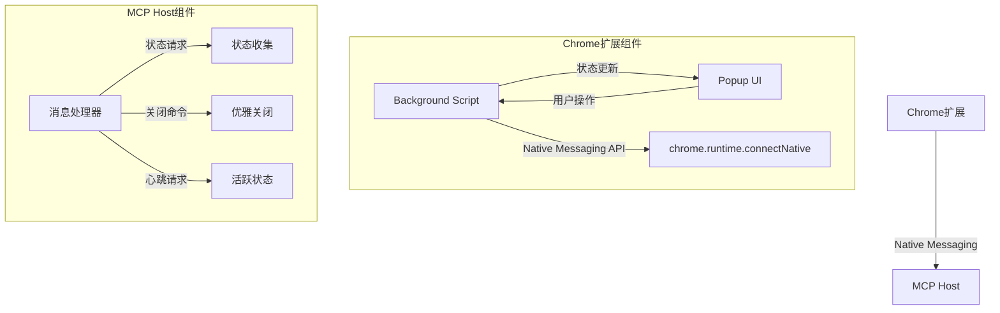

# MCP Host 状态监控与控制设计方案

## 1. 需求概述

为Chrome扩展实现对MCP Host的状态监控和控制功能，包括：

- 查看MCP Host的运行状态（是否运行、版本、运行时间等）
- 启动MCP Host（支持配置运行模式和端口）
- 停止MCP Host（支持优雅关闭）

## 2. 整体架构设计



## 3. 组件职责

### 3.1 Chrome扩展组件

#### 3.1.1 Background Script (MCP Host Manager)

- **职责**:
  - 管理与MCP Host的连接状态
  - 通过Native Messaging与MCP Host通信
  - 发送心跳检测、状态请求等命令
  - 处理MCP Host启动和停止
  - 维护和广播MCP Host状态

- **核心功能**:
  - 连接管理: 建立与MCP Host的连接、处理断开重连
  - 状态监控: 定期发送心跳检测，更新状态信息
  - 状态广播: 向界面组件通知状态变化
  - 进程控制: 使用Chrome API启动/停止MCP Host

#### 3.1.2 Popup UI

- **职责**:
  - 展示MCP Host当前状态(运行状态、版本、运行时间等)
  - 提供启动/停止MCP Host的控制按钮
  - 提供配置选项(运行模式、端口、日志级别等)

- **核心功能**:
  - 状态展示: 可视化显示MCP Host状态
  - 用户交互: 处理启动/停止等用户操作
  - 配置管理: 保存用户配置选项

### 3.2 MCP Host组件

#### 3.2.1 消息处理器

- **职责**:
  - 接收Chrome扩展发送的命令
  - 处理各类请求(状态、心跳等)
  - 执行关闭命令实现优雅退出

- **核心功能**:
  - 命令处理: 解析和响应来自扩展的消息
  - 状态报告: 收集和返回当前状态信息
  - 关闭流程: 处理关闭请求，确保资源正确释放

## 4. 通信协议

### 4.1 扩展到MCP Host

扩展通过Native Messaging向MCP Host发送的消息格式:

```typescript
// 状态请求
{
  type: 'getStatus'
}

// 心跳检测
{
  type: 'ping'
}

// 关闭请求
{
  type: 'shutdown'
}
```

### 4.2 MCP Host到扩展

MCP Host响应的消息格式:

```typescript
// 状态响应
{
  type: 'status',
  data: {
    isConnected: true,
    startTime: 1630000000000, // 时间戳
    version: '0.1.0',
    runMode: 'stdio' // 或 'http+stdio'
  }
}

// 心跳响应
{
  type: 'ping_result',
  timestamp: 1630000010000 // 时间戳
}

// 错误响应
{
  type: 'error',
  error: '错误描述'
}
```

## 5. 实现策略

### 5.1 状态监控实现

- 使用定期心跳检测确认MCP Host活跃状态
- 在连接建立时请求完整状态信息
- 计算并展示运行时间、最后心跳时间等派生信息

### 5.2 启动/停止控制实现

- 启动: 使用Chrome API启动MCP Host程序
- 停止: 先发送优雅关闭请求，如果超时则强制终止
- 提供可配置选项，如运行模式、HTTP端口等

### 5.3 用户界面设计原则

- 状态指示器使用颜色编码(绿色=运行，红色=未运行)
- 详细信息区域显示版本、模式、运行时间等
- 启动配置区域允许设置运行参数
- 按钮状态动态更新反映当前可执行的操作

## 6. 安全考虑

- 使用Chrome的Native Messaging安全机制限制通信
- 通过manifest文件的allowed_origins限制访问权限
- 确保所有用户输入经过验证后再传递给MCP Host
- 定期检查连接状态，防止"僵尸"进程

## 7. 后续规划

- MCP资源和工具的细粒度配置界面
- 日志查看器功能，支持实时查看MCP Host日志
- 资源监控增强，显示CPU/内存使用情况
- 支持多MCP Host实例管理
