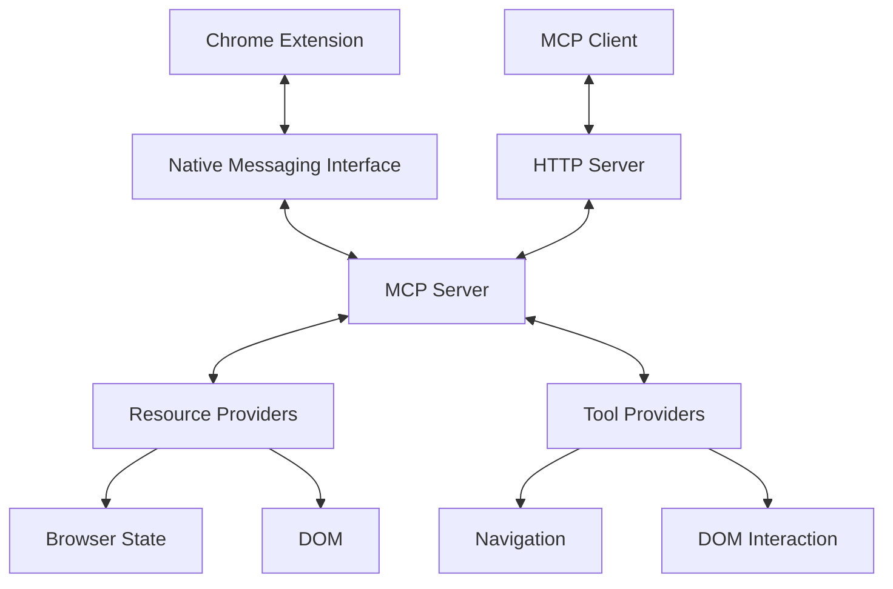

# MCP Server Design: Streamable HTTP Protocol Implementation

## Overview

This document outlines the design for implementing the Model Context Protocol (MCP) server using the Streamable HTTP protocol. The implementation will replace the current simplified implementation with a standards-compliant version that uses the official MCP SDK.

## Architecture

The architecture consists of these primary components:

1. **Native Messaging Interface**: Communicates with the Chrome extension using Chrome's native messaging protocol
2. **MCP HTTP Server**: Implements the Streamable HTTP protocol for MCP clients
3. **Resource Providers**: Expose browser state and DOM as MCP resources
4. **Tool Providers**: Implement browser interaction tools for MCP clients



## Key Components

### BrowserMcpServer Class

The central class that coordinates all MCP operations:

```typescript
export class BrowserMcpServer {
  constructor(port: number = 8765) {...}
  
  public async start(): Promise<void> {...}
  public async stop(): Promise<void> {...}
  public registerActionCallback(callback: ActionCallback): void {...}
  public setBrowserState(state: BrowserState): void {...}
  
  private setupExpressRoutes(): void {...}
  private registerTools(): void {...}
  private registerResources(): void {...}
}
```

### HTTP Server Implementation

Implements the Streamable HTTP protocol:

1. **Session Management**: Creates, tracks, and terminates client sessions
2. **Request Handling**: Processes JSON-RPC requests from clients
3. **Server-Sent Events**: Sends notifications to clients using SSE
4. **Error Handling**: Provides standardized error responses

### Resource Implementation

Resources exposed through the MCP protocol:

1. **Browser State Resource**: Current browser state including active tab and all tabs
2. **DOM Resource**: DOM structure of the current active page

### Tool Implementation

Tools exposed through the MCP protocol:

1. **Navigation Tools**: Navigate to URL, back, forward, refresh
2. **DOM Interaction Tools**: Click elements, fill forms, extract data

## Protocol Flow

### Session Initialization

1. MCP client sends an HTTP POST with an `initialize` request
2. Server generates a session ID and responds with session capabilities
3. Client uses the session ID in all subsequent requests

### Resource Access

1. Client lists available resources
2. Client reads specific resources using their URIs
3. Server returns resource content

### Tool Execution

1. Client lists available tools
2. Client calls specific tools with parameters
3. Server executes the tool and returns result

### Notifications

1. Server sends server-to-client notifications via SSE
2. Client receives notifications about state changes

### Session Termination

1. Client sends DELETE request with session ID
2. Server cleans up resources associated with the session

## Implementation Plan

1. Add required dependencies to package.json
   - @modelcontextprotocol/sdk
   - express
   - zod for validation

2. Create the BrowserMcpServer class with HTTP server implementation

3. Connect the Native Messaging interface with the MCP Server

4. Implement resource providers for browser state and DOM

5. Implement tool providers for browser interaction

6. Add comprehensive testing

## Testing Strategy

1. **Unit Tests**: Test individual components in isolation
2. **Integration Tests**: Test communication between components
3. **End-to-End Tests**: Test complete MCP client-server interaction

## Security Considerations

1. **Input Validation**: Validate all incoming requests using zod
2. **Error Handling**: Provide minimal error information to clients
3. **Resource Limitations**: Limit resource sizes and request frequencies
4. **Session Isolation**: Ensure sessions are isolated from each other
