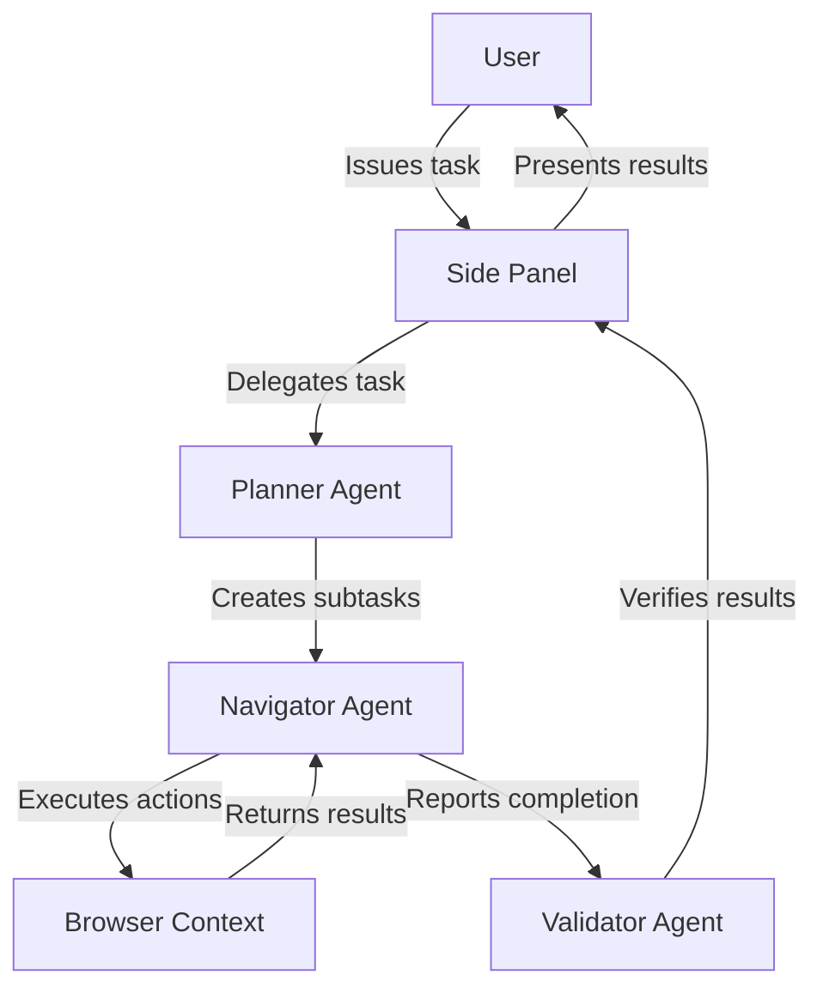
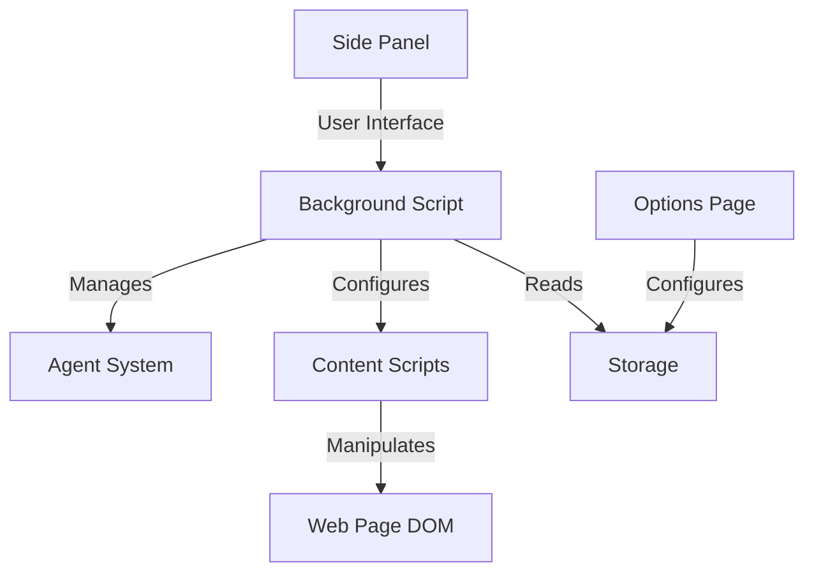
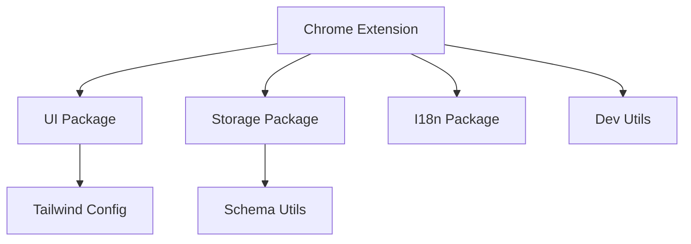
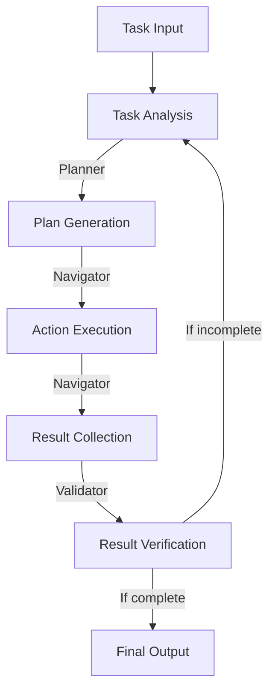

# System Patterns: Nanobrowser

## System Architecture

Nanobrowser follows a Chrome extension architecture with a multi-agent system design. The core architecture includes:

### 1. Extension Structure
- **Background Script**: Manages the core extension functionality and agent system
- **Content Scripts**: Interact with web pages for DOM manipulation and extraction
- **Side Panel**: Provides the user interface for interacting with the agent system
- **Options Page**: Allows configuration of LLM providers and agent models

### 2. Multi-Agent System
The extension employs a collaborative multi-agent architecture:

- **Planner Agent**: Responsible for task decomposition and strategy development
- **Navigator Agent**: Executes browser interactions and interprets web content
- **Validator Agent**: Verifies task completion and result accuracy

### 3. Communication Flow
- **User → Extension**: Via the side panel interface
- **Between Agents**: Through structured message passing
- **Extension → Web Page**: Via content scripts and browser APIs
- **Agent → LLM**: Through configured provider APIs

## Key Technical Decisions

### 1. Multi-Package Monorepo Structure
Nanobrowser uses a monorepo approach with pnpm workspaces, separating functionality into distinct packages:

- **Chrome Extension**: The main extension implementation
- **UI Package**: Shared UI components
- **Storage Package**: Data persistence mechanisms
- **I18n Package**: Internationalization support
- **HMR Package**: Hot module replacement for development
- **Schema Utils**: Schema validation utilities
- **Dev Utils**: Development utilities

This structure enables better code organization, reuse, and targeted testing.

### 2. Browser Extension Framework
Leveraging Vite for modern bundling and Chrome Extension API for browser integration, providing:

- Fast HMR during development
- Efficient bundling for production
- Access to browser APIs for automation

### 3. Agent System Design
- **Prompt Engineering**: Specialized prompts for different agent roles
- **Context Management**: Maintaining and passing relevant context between agents
- **Task Decomposition**: Breaking complex tasks into manageable steps

### 4. LLM Provider Integration
- **Provider Abstraction**: Consistent interface across different LLM providers
- **Model Selection**: Flexible assignment of models to different agents
- **Efficient Prompting**: Minimizing token usage while maximizing effectiveness

## Design Patterns in Use

### 1. Observer Pattern
Used for event handling and updates between different parts of the extension:
- Background script observes tab changes and browser events
- UI components observe state changes for rendering updates

### 2. Factory Pattern
Implemented for creating agent instances with appropriate configuration:
- Agent factory creates agents with specific roles
- Provider factory creates appropriate LLM provider connectors

### 3. Strategy Pattern
Applied to allow interchangeable algorithms:
- Different navigation strategies based on website structure
- Alternative validation approaches based on task type

### 4. Command Pattern
Used for encapsulating browser automation actions:
- Click commands
- Scroll commands
- Form input commands
- Navigation commands

### 5. Adapter Pattern
Implemented for LLM provider integration:
- Unified interface for different LLM APIs
- Translation between provider-specific responses and internal formats

## Component Relationships

### 1. Extension Components

### 2. Package Dependencies

### 3. Agent Interaction Model

## Critical Implementation Paths

### 1. Task Execution Flow
1. User inputs task in side panel
2. Planner agent analyzes and decomposes task
3. Navigator agent executes actions in sequence
4. DOM is manipulated and content extracted
5. Validator agent verifies task completion
6. Results presented to user with follow-up capability

### 2. LLM Integration Path
1. Agent requires LLM processing
2. Provider configuration retrieved from storage
3. Request formatted according to provider requirements
4. API call made to appropriate endpoint
5. Response processed and returned to agent
6. Agent continues execution based on response

### 3. Browser Automation Path
1. Navigator agent determines required actions
2. Commands formatted for content script execution
3. Content script executes DOM manipulation
4. Results and page state returned to navigator
5. Navigator determines next action based on state

This system architecture and these patterns provide the foundation for Nanobrowser's implementation, guiding development decisions and ensuring consistent design across the project.
