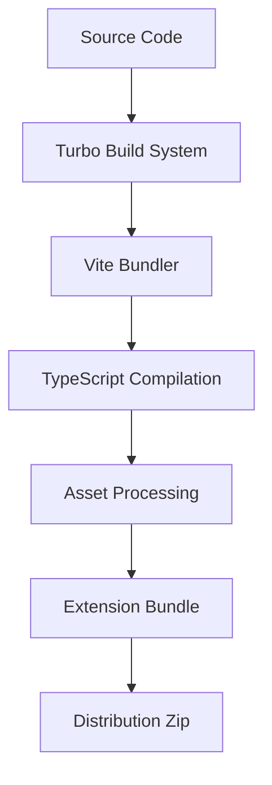

# Technical Context: Nanobrowser

## Technologies Used

### Core Technologies
- **TypeScript**: Primary programming language for type safety and developer experience
- **React**: UI library for building the extension's user interfaces
- **Chrome Extension API**: For browser integration and automation
- **Vite**: Modern bundler for fast development and optimized production builds
- **Tailwind CSS**: Utility-first CSS framework for styling

### Package Management & Build System
- **pnpm**: Fast, disk-efficient package manager with workspace support
- **Turbo**: Build system for monorepo optimization
- **ESBuild**: JavaScript bundler used by Vite for high-performance builds

### Testing & Quality
- **ESLint**: JavaScript and TypeScript linting
- **Prettier**: Code formatting
- **Husky**: Git hooks for pre-commit validation
- **lint-staged**: Run linters on staged files

### State Management
- **Chrome Storage API**: For persisting extension state and user preferences
- **React Context**: For component-level state management

### LLM Integration
- **OpenAI API**: Integration with OpenAI models
- **Anthropic API**: Integration with Claude models
- **Gemini API**: Integration with Google's Gemini models
- **Ollama**: Integration with locally-run models

## Development Setup

### Environment Requirements
- **Node.js**: v22.12.0 or higher
- **pnpm**: v9.15.1 or higher
- **Chrome**: Latest version for extension testing

### Project Structure
The project follows a monorepo structure using pnpm workspaces:

```
nanobrowser/
├── chrome-extension/     # Main extension implementation
├── packages/             # Shared packages
│   ├── dev-utils/        # Development utilities
│   ├── hmr/              # Hot Module Replacement
│   ├── i18n/             # Internationalization
│   ├── schema-utils/     # Schema validation
│   ├── shared/           # Shared utilities
│   ├── storage/          # Storage abstractions
│   ├── tailwind-config/  # Shared Tailwind configuration
│   ├── tsconfig/         # Shared TypeScript configurations
│   ├── ui/               # Shared UI components
│   └── vite-config/      # Shared Vite configuration
├── pages/                # Extension pages
│   ├── content/          # Content script
│   ├── options/          # Options page
│   └── side-panel/       # Side panel UI
```

### Development Workflow
1. **Installation**: `pnpm install`
2. **Development**: `pnpm dev` (with hot reloading)
3. **Building**: `pnpm build`
4. **Testing**: Manual testing in Chrome
5. **Packaging**: `pnpm zip` creates distributable extension

### Chrome Extension Loading
- **Development**: Load unpacked extension from `dist` directory
- **Production**: Install from Chrome Web Store
- **Manual Installation**: Load from downloaded zip file

## Technical Constraints

### Browser Limitations
- **Extension API Constraints**: Limited by what Chrome Extension API allows
- **Content Script Isolation**: Content scripts run in isolated contexts
- **Cross-Origin Restrictions**: Standard web security practices apply
- **Manifest V3 Limitations**: Working within Chrome's extension manifest V3 constraints

### Performance Considerations
- **LLM Response Time**: Dependent on external API response times
- **Browser Resource Usage**: Extensions share resources with browser
- **Token Limitations**: LLM APIs have context window constraints
- **Storage Limitations**: Chrome storage has size limits

### API Constraints
- **Rate Limiting**: LLM APIs have usage limits
- **Latency**: Network latency affects real-time interactions
- **Token Costs**: LLM API usage incurs costs based on tokens

### Browser Compatibility
- **Chrome-First**: Primarily designed for Chrome
- **Firefox Compatibility**: Secondary support for Firefox with specific adaptations

## Dependencies

### Production Dependencies
- **React**: ^18.3.1
- **React DOM**: ^18.3.1
- **Tailwind CSS**: For utility-first styling

### Development Dependencies
- **TypeScript**: 5.5.4
- **Vite**: 6.0.12
- **ESLint**: 8.57.0
- **Prettier**: ^3.3.3
- **Turbo**: ^2.3.3
- **Husky**: ^9.1.4
- **lint-staged**: ^15.2.7
- **Chrome Types**: ^0.0.270

### External Services
- **OpenAI API**: For GPT model access
- **Anthropic API**: For Claude model access
- **Google AI API**: For Gemini model access

## Tool Usage Patterns

### Build Process


1. **Development Build**: Fast builds with HMR for immediate feedback
2. **Production Build**: Optimized, minified builds for distribution
3. **Firefox Build**: Adapted builds for Firefox compatibility

### Code Quality Workflow
- **Pre-commit**: Husky runs lint-staged to ensure code quality
- **Linting**: ESLint checks code for errors and style issues
- **Formatting**: Prettier ensures consistent code style
- **Type Checking**: TypeScript validates type correctness

### Version Management
- **Package Versioning**: Controlled via `update_version.sh` script
- **Monorepo Dependencies**: Managed by pnpm workspace
- **Chrome Store Deployment**: Manual upload of built zip file

### Extension Development Patterns
- **Background Script Development**: Long-running extension processes
- **Content Script Injection**: Web page interaction scripts
- **Side Panel Development**: UI for user interaction
- **Options Page Development**: Configuration interface
- **Storage Management**: Persistent data handling

This technical context provides the foundation for understanding the development environment, constraints, and practices used in the Nanobrowser project.
