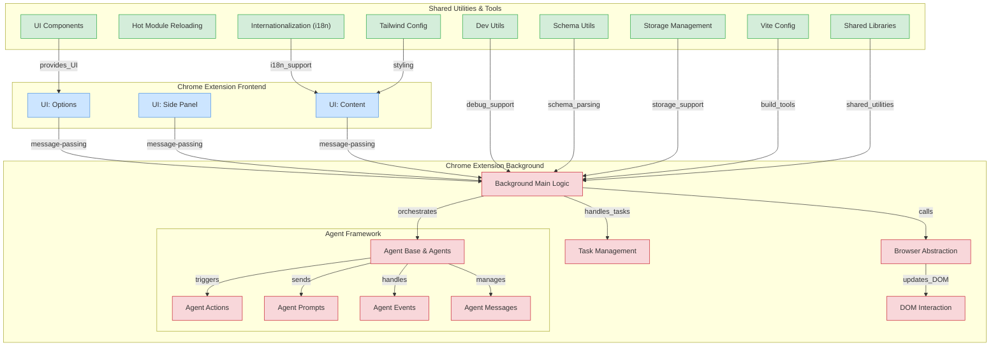

```mermaid
flowchart TD
    %% Chrome Extension Frontend
    subgraph "Chrome Extension Frontend"
        UIOptions["UI: Options"]:::ui
        UISidePanel["UI: Side Panel"]:::ui
        UIContent["UI: Content"]:::ui
    end

    %% Chrome Extension Background
    subgraph "Chrome Extension Background"
        BGMain["Background Main Logic"]:::bg
        subgraph "Agent Framework"
            AgentBase["Agent Base & Agents"]:::bg
            AgentActions["Agent Actions"]:::bg
            AgentPrompts["Agent Prompts"]:::bg
            AgentEvents["Agent Events"]:::bg
            AgentMessages["Agent Messages"]:::bg
        end
        BrowserAbstraction["Browser Abstraction"]:::bg
        DOMInteraction["DOM Interaction"]:::bg
        TaskManager["Task Management"]:::bg
    end

    %% Shared Utilities & Tools
    subgraph "Shared Utilities & Tools"
        DevUtils["Dev Utils"]:::util
        HMR["Hot Module Reloading"]:::util
        i18n["Internationalization (i18n)"]:::util
        SchemaUtils["Schema Utils"]:::util
        SharedLibs["Shared Libraries"]:::util
        UIComponents["UI Components"]:::util
        StorageManager["Storage Management"]:::util
        TailwindConfig["Tailwind Config"]:::util
        ViteConfig["Vite Config"]:::util
    end

    %% Interactions between Frontend and Background
    UIOptions -->|"message-passing"| BGMain
    UISidePanel -->|"message-passing"| BGMain
    UIContent -->|"message-passing"| BGMain

    %% Background internal interactions
    BGMain -->|"orchestrates"| AgentBase
    AgentBase -->|"triggers"| AgentActions
    AgentBase -->|"sends"| AgentPrompts
    AgentBase -->|"handles"| AgentEvents
    AgentBase -->|"manages"| AgentMessages
    BGMain -->|"calls"| BrowserAbstraction
    BrowserAbstraction -->|"updates_DOM"| DOMInteraction
    BGMain -->|"handles_tasks"| TaskManager

    %% Shared Utilities interactions with Frontend
    UIComponents -->|"provides_UI"| UIOptions
    i18n -->|"i18n_support"| UIContent

    %% Shared Utilities interactions with Background
    DevUtils -->|"debug_support"| BGMain
    SchemaUtils -->|"schema_parsing"| BGMain
    StorageManager -->|"storage_support"| BGMain
    TailwindConfig -->|"styling"| UIContent
    ViteConfig -->|"build_tools"| BGMain
    SharedLibs -->|"shared_utilities"| BGMain

    %% Click Events for Chrome Extension Frontend
    click UIOptions "https://github.com/nanobrowser/nanobrowser/tree/master/pages/options"
    click UISidePanel "https://github.com/nanobrowser/nanobrowser/tree/master/pages/side-panel"
    click UIContent "https://github.com/nanobrowser/nanobrowser/tree/master/pages/content"

    %% Click Events for Chrome Extension Background
    click BGMain "https://github.com/nanobrowser/nanobrowser/tree/master/chrome-extension/src/background"
    click AgentBase "https://github.com/nanobrowser/nanobrowser/tree/master/chrome-extension/src/background/agent/agents"
    click AgentActions "https://github.com/nanobrowser/nanobrowser/tree/master/chrome-extension/src/background/agent/actions"
    click AgentPrompts "https://github.com/nanobrowser/nanobrowser/tree/master/chrome-extension/src/background/agent/prompts"
    click AgentEvents "https://github.com/nanobrowser/nanobrowser/tree/master/chrome-extension/src/background/agent/event"
    click AgentMessages "https://github.com/nanobrowser/nanobrowser/tree/master/chrome-extension/src/background/agent/messages"
    click BrowserAbstraction "https://github.com/nanobrowser/nanobrowser/tree/master/chrome-extension/src/background/browser"
    click DOMInteraction "https://github.com/nanobrowser/nanobrowser/tree/master/chrome-extension/src/background/dom"
    click TaskManager "https://github.com/nanobrowser/nanobrowser/tree/master/chrome-extension/src/background/task"

    %% Click Events for Shared Utilities & Tools
    click DevUtils "https://github.com/nanobrowser/nanobrowser/tree/master/packages/dev-utils"
    click HMR "https://github.com/nanobrowser/nanobrowser/tree/master/packages/hmr"
    click i18n "https://github.com/nanobrowser/nanobrowser/tree/master/packages/i18n"
    click SchemaUtils "https://github.com/nanobrowser/nanobrowser/tree/master/packages/schema-utils"
    click SharedLibs "https://github.com/nanobrowser/nanobrowser/tree/master/packages/shared"
    click UIComponents "https://github.com/nanobrowser/nanobrowser/tree/master/packages/ui"
    click StorageManager "https://github.com/nanobrowser/nanobrowser/tree/master/packages/storage"
    click TailwindConfig "https://github.com/nanobrowser/nanobrowser/tree/master/packages/tailwind-config"
    click ViteConfig "https://github.com/nanobrowser/nanobrowser/tree/master/packages/vite-config"

    %% Styles
    classDef ui fill:#cce5ff,stroke:#4a90e2,stroke-width:1px;
    classDef bg fill:#f8d7da,stroke:#c82333,stroke-width:1px;
    classDef util fill:#d4edda,stroke:#28a745,stroke-width:1px;
```